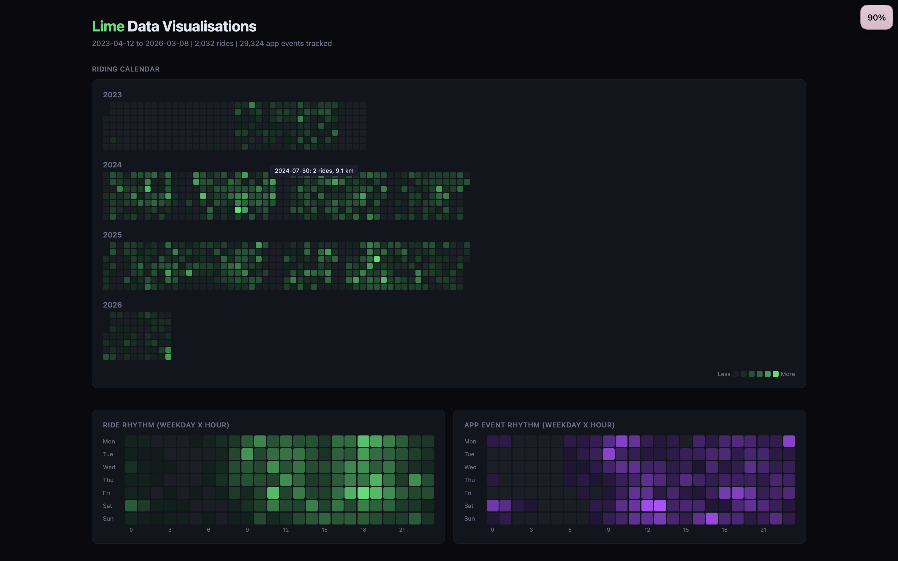

# Lime

Visualise your Lime (ebike/scooter) GDPR data export -- interactive maps, dashboards, and surveillance analysis.

## What you get

**Interactive map** with 6 visualisation modes (arcs, time-of-day, density, heatmap, 3D hexbin, animated 24h cycle):

**Main dashboard** with stats, charts, and spending breakdown:

**Deep visualisations** -- calendar heatmap, speed trends, daily rhythm, app event surveillance:

## How to use

1. Request your Lime data via [privacy.li.me](https://privacy.li.me/)
2. Start a Claude session, share [skill.md](skill.md) and your data CSVs
3. Ask Claude to build the dashboards

No build tools needed -- everything runs as plain HTML with CDN dependencies.

## Learn more

Read the full writeup: [Lime is a Data Company](https://ktoya.me/lime-data-company/)
